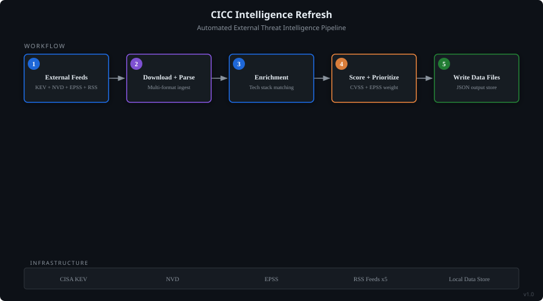

# CICC Intelligence Refresh

> On-demand external cyber intelligence pipeline and briefing generator for the Cyber Intelligence Command Center.

## Architecture

*System-model diagram showing the agent's workflow, data flow, and supporting infrastructure.*

## Problem It Solves

On-demand external cyber intelligence pipeline and briefing generator for the Cyber Intelligence Command Center. Fetches live data from CISA KEV, NVD, EPSS, and 5 RSS attack landscape feeds, enriches and scores events against the the organization technology watchlist, writes updated JSON data files, and generates executive security posture briefings on demand.

## How It Works

- **TIER 1 -- Critical Infrastructure**: | Vendor | Products / Aliases |
- **TIER 2 -- Business Operations**: | Vendor | Products / Aliases |
- **Matching Rules**: Use word-boundary regex to avoid false positives (e.g., "outlook" in "raised its outlook" is NOT Microsoft Outlook)
- **Step 1: Fetch Sources (parallel)**: Fetch all 6 sources simultaneously:
- **Step 2: Filter KEV to 30-day window**: Filter vulnerabilities where dateAdded is within the last 30 days.

## Key Capabilities

- **TIER 1 -- Critical Infrastructure**
- **TIER 2 -- Business Operations**
- **Matching Rules**
- Use word-boundary regex to avoid false positives (e.g., "outlook" in "raised its outlook" is NOT Microsoft Outlook)
- If vendorProject in KEV data equals "Microsoft", that is always a DIRECT match regardless of product name
- If a vendor appears only as a research publisher (e.g., "Unit 42" for Palo Alto), classify as SOURCE ONLY, not DIRECT
- Product Criticality scoring: Tier 1 = 6/6 points, Tier 2 = 4/6 points
- Vendor aliases should be checked alongside primary names

## Technologies

## Built With

Built with [Amazon Quick](https://github.com/SwooshJ-SecAI) as a custom AI agent.

---
*Part of the [SwooshJ-SecAI](https://github.com/SwooshJ-SecAI) security and AI engineering portfolio.*
