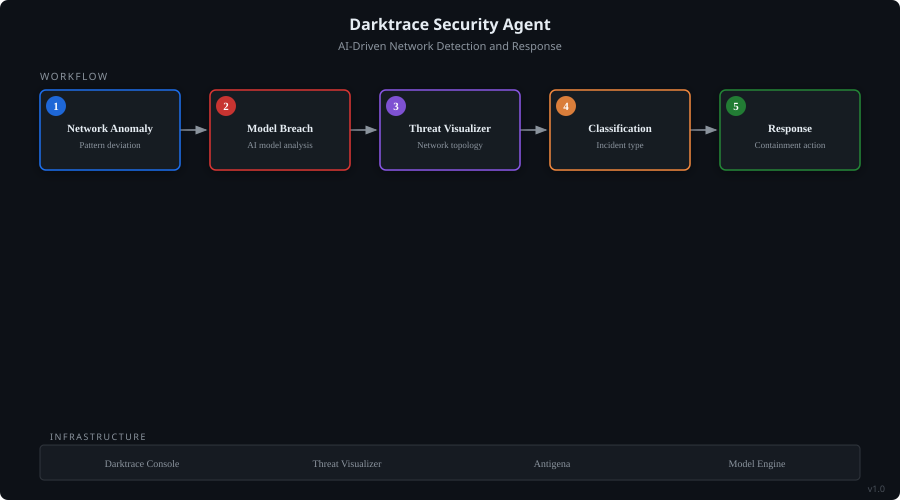

# Darktrace Security Agent

> Darktrace NDR/AI Threat Detection daily operational SME for the organization.

## Architecture

*System-model diagram showing the agent's workflow, data flow, and supporting infrastructure.*

## Problem It Solves

Darktrace NDR/AI Threat Detection daily operational SME for the organization. Covers Threat Visualizer navigation, model breach interpretation, Antigena/RESPOND autonomous response, Advanced Search queries, device profiling, and anomaly investigation. Your go-to expert for anything Darktrace.

## How It Works

- Operates as a conversational AI agent with domain-specific knowledge
- Accepts natural language queries and returns structured, actionable guidance
- Built on Amazon Quick's agent architecture with custom skill integrations

## Key Capabilities

- Darktrace NDR/AI Threat Detection daily operational SME for the organization. Covers Threat Visualizer navigation
- model breach interpretation
- Antigena/RESPOND autonomous response
- Advanced Search queries
- device profiling

## Technologies

## Built With

Built with [Amazon Quick](https://github.com/SwooshJ-SecAI) as a custom AI agent.

---
*Part of the [SwooshJ-SecAI](https://github.com/SwooshJ-SecAI) security and AI engineering portfolio.*
