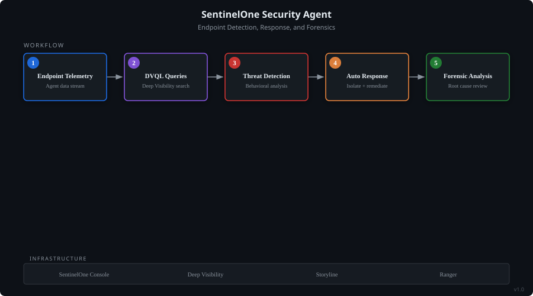

# SentinelOne Security Agent

> SentinelOne EDR/XDR daily operational SME for the organization.

## Architecture

*System-model diagram showing the agent's workflow, data flow, and supporting infrastructure.*

## Problem It Solves

SentinelOne EDR/XDR daily operational SME for the organization. Covers Deep Visibility (DVQL) query building, threat detection interpretation, endpoint isolation/remediation, policy management, agent deployment, and Storyline analysis. Your go-to expert for anything SentinelOne.

## How It Works

- Operates as a conversational AI agent with domain-specific knowledge
- Accepts natural language queries and returns structured, actionable guidance
- Built on Amazon Quick's agent architecture with custom skill integrations

## Key Capabilities

- SentinelOne EDR/XDR daily operational SME for the organization. Covers Deep Visibility (DVQL) query building
- threat detection interpretation
- endpoint isolation/remediation
- policy management
- agent deployment

## Technologies

## Built With

Built with [Amazon Quick](https://github.com/SwooshJ-SecAI) as a custom AI agent.

---
*Part of the [SwooshJ-SecAI](https://github.com/SwooshJ-SecAI) security and AI engineering portfolio.*
